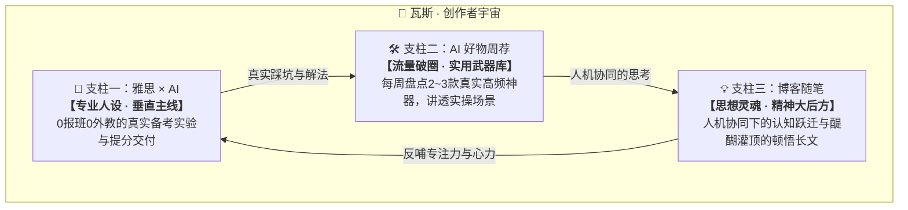

# 🌌 瓦斯 · 创作者宇宙 (Gas Universe)
### *Building in Public · AI Native 探索者与实践者*

  
  
  
  
  

---

## 🧭 瓦斯的初衷与宇宙宣言

> **“在 AI 爆发的新时代，一个不报班、不请外教的普通人，纯靠 AI 能在短期内把雅思学到什么水平？”**  
> **“如何借力 AI 摆脱内耗与完美主义，持续输出有价值的产品与思考？”**

这里是**瓦斯（Curry）**的**个人数字宇宙母港**。我选择将全部学习、创作、认知迭代与工具开发过程**全量透明公开（Building in Public）**。

- **不搞虚假包装**：展示真实的卡点、挫折与突破，做大家真实的**“行动替”**。
- **拒绝爹味说教**：不灌鸡汤，只分享亲身踩坑并验证有效的实战方法。
- **持续微小迭代**：努力进步，不求完美，从最小动作开始，持之以恒。
- **Agent 零损耗协作**：本宇宙下所有仓库均配备标准的 `PROJECT_STATE.md` 记忆中枢。任何 AI 协作伙伴（Agent）介入时，读取文档即可在 2 秒内无缝对齐上下文，零记忆损耗。

---

## 🏛️ 三大核心支柱 (The Three Core Pillars)

整个瓦斯宇宙由**“专业人设 + 流量武器库 + 思想灵魂”**三大核心支柱驱动：

---

### 📘 支柱一：雅思 × AI（核心垂直主线）

双轨并行，兼顾日常高频触达与高价值深度交付：

| 子系统 | 形式与阵地 | 仓库与链接 | 核心使命 |
| :--- | :--- | :--- | :--- |
| **📱 雅思日记** | 轻量 Web 工作台 *(小红书日常)* | [`yaemra531-stack/diary-content-system`](https://github.com/yaemra531-stack/diary-content-system) | **真实过程记录（Doing）**：灵感来了随手记，记录今天用 AI 试了什么、卡在哪里、攻克了什么。一键生成小红书日记排版。 |
| **📚 雅思干货** | 16步深度草稿库 *(长图文/合集)* | [`yaemra531-stack/creator-workspace`](https://github.com/yaemra531-stack/creator-workspace) | **方法验证交付（Output）**：将日记中摸索出来并切实验证有效的 AI 提分方案，沉淀为 16 步深度图文干货与实操 SOP（如《单词总记不住？我用 AI 换了个方法》）。 |

---

### 🛠️ 支柱二：AI 好物周荐（实用武器库）

* **载体**：[`creator-workspace/04-AI好物周荐`](https://github.com/yaemra531-stack/creator-workspace/tree/main/04-AI%E5%A5%BD%E7%89%A9%E5%91%A8%E8%8D%90)
* **定位**：每周自用精选。不求多，只挑真实使用的 2~3 款最强 AI 生产力工具或小众神器。
* **原则**：真实自用、不吹不黑、列出深度理由与落地场景，让工具真正赋能普通人。

---

### 💡 支柱三：博客随笔（思想灵魂与认知跃迁）

* **载体**：🌐 **[墨语 · 独立博客 (Ink & Thought)](https://yaemra531-stack.github.io/ink-thought-blog/)** | 仓库：[`yaemra531-stack/ink-thought-blog`](https://github.com/yaemra531-stack/ink-thought-blog)
* **定位**：瓦斯的思想自留地与精神后花园。
* **沉淀内容**：
  * 深度长文与顿悟笔记（如《努力进步，不求完美：戒掉完美主义与用力过猛》）；
  * 人与 AI 协同进化的心法；
  * 读书与认知跃迁复盘。

---

## 🛠️ 配套开发者生态工具

* 💻 **[Antigravity CLI Statusline](https://github.com/yaemra531-stack/antigravity-cli-statusline)**：跨平台 Antigravity CLI 底部状态栏扩展，支持多语系、额度消耗与运行状态监控。

---

## 🗺️ 瓦斯的创作者路线图 (Roadmap)

- [x] **Phase 1 · 宇宙奠基（2026-09）**：梳理三大支柱，完成系统解耦，建立 GitHub 全量公开母港。
- [ ] **Phase 2 · 雅思日记前锋起跑**：在小红书连载首批 7 篇日常备考日记，测试读者对 AI 备考真实痛点的反馈。
- [ ] **Phase 3 · 首批 AI 雅思深度干货发布**：打磨发布《单词总记不住？我换了个方法（配图实素材）》。
- [ ] **Phase 4 · 启动《AI好物周荐》专栏**：正式发布第 1 期自用精选工具图文。
- [ ] **Phase 5 · 博客随笔认知专栏常态化**：定期在独立博客沉淀高质量思想随笔。

---

## 📅 创作者航海日志 (Daily & Weekly Changelog)

| 日期 | 板块 | 关键里程碑 / 记录 |
| :--- | :--- | :--- |
| **2026-09-27** | 🌌 宇宙启动 | **瓦斯 · 创作者宇宙正式启航！** 明确三大核心支柱；全量开源公开所有子仓库；确立 GitHub Profile 个人主页第一屏母港。 |
| **2026-09-27** | 💡 博客随笔 | 提炼核心心法《努力进步，不求完美：戒掉完美主义与用力过猛，从最小动作持之以恒》。 |
| **2026-09-21** | 📚 雅思干货 | 完成首篇 16 步深度图文草稿《单词总记不住？我换了个方法（配图实素材）》定位与正文框架。 |

---

  <i>努力进步，不求完美 · 持续微小迭代 · 建造属于自己的宇宙</i> 
  Created with passion by 瓦斯 (Gas / Curry) · Powered by Antigravity Agent

